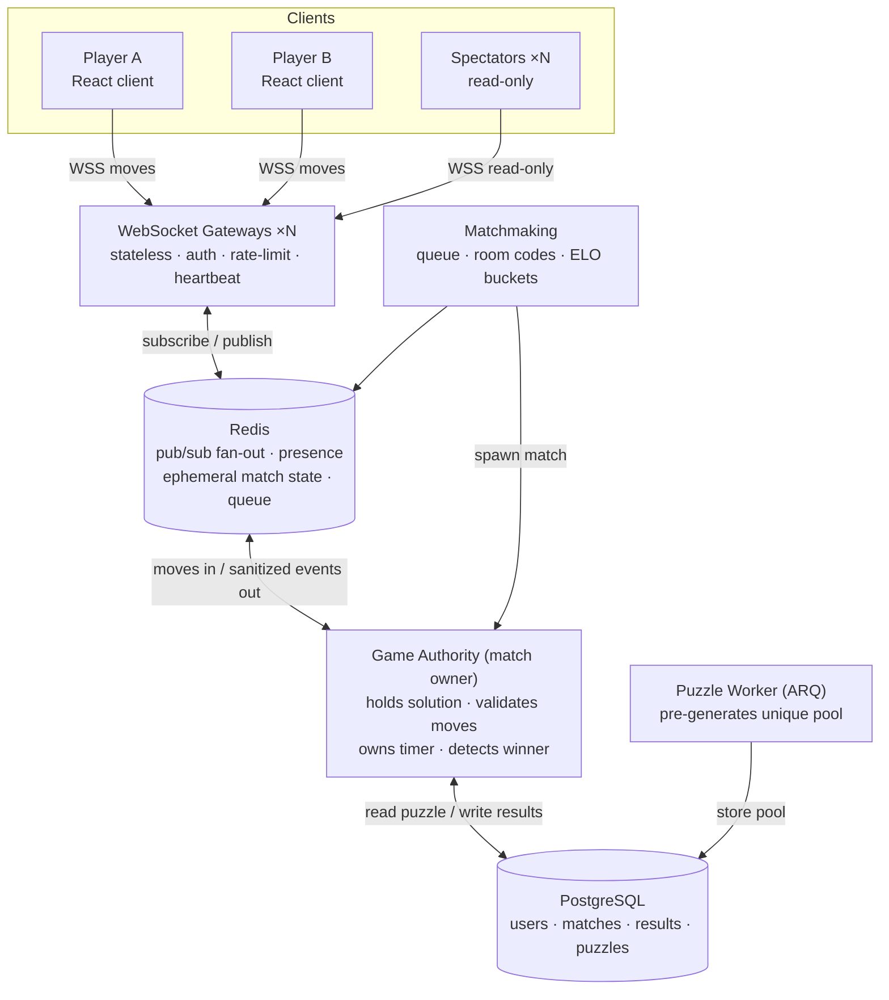
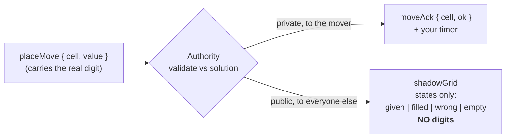
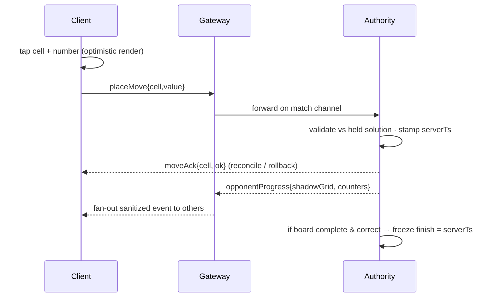
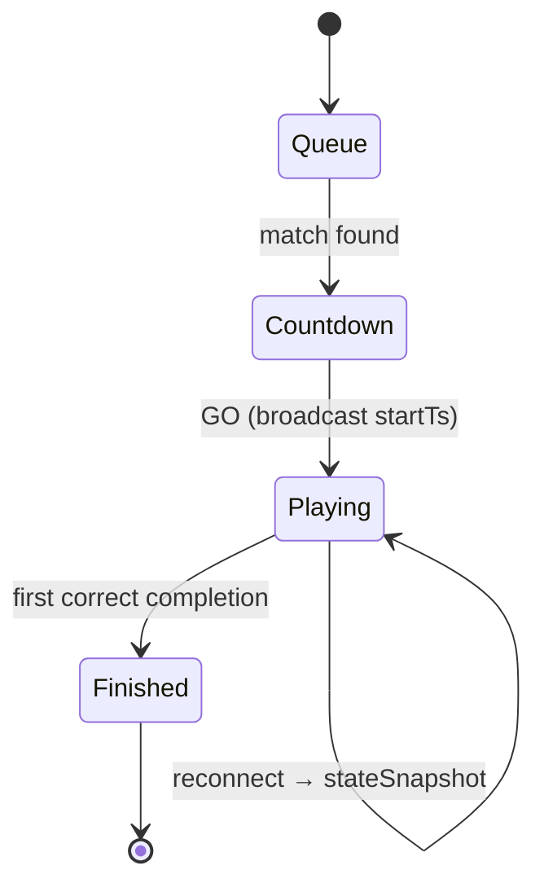

# Architecture

Realtime competitive Sudoku. N players solve **one identical puzzle** on a synchronized timer; everyone watches everyone fill in live, but **no one sees an opponent's digits**. The server is the single source of truth for state, time, and the win.

## System topology

Stateless gateways scale horizontally; Redis fans messages across them. Each match is **homed on one authority owner** (consistent hash of `matchId`) so validation and win-detection are serialized — no race on "who finished first." Postgres holds only durable data; live state is Redis/in-memory.

## The core trick — privacy-preserving progress

The board fills in for spectators like a progress bar they can't copy from. Fidelity is tunable: full shadow grid for drama, or just `%complete` for a ranked/anti-leak mode (same event, less verbosity). Spectator updates are **coalesced to ~3/sec per player** to bound fan-out bandwidth.

## Move flow & authoritative timing

**Timer:** match carries a server `startTs` sent at the synchronized `3·2·1·GO` reveal. Clients render a smooth local clock from `now − startTs`, but official elapsed = `serverReceiveTs(winningMove) − startTs`.

## Match lifecycle (mirrored: XState front, server state back)

On reconnect (common on mobile) the server replays a `stateSnapshot`: your board, opponents' shadow grids, and elapsed. Heartbeat ping/pong; grace window before forfeit.

## Integrity & anti-cheat
- **Solution never ships** — clients get givens only; correctness is a server reply.
- **Server-owned time** — finish stamped on receipt of the completing move.
- **Every move validated** — no client-claimed completion; full board re-checked.
- **Anomaly guard** — per-connection move rate-limit; flag superhuman solve curves.
- **Spectators are read-only** — inbound moves on spectator sockets are rejected.

## Puzzle generation (Python, server-only)
1. Fill an empty grid via randomized backtracking → a complete valid solution.
2. Dig cells in random order; after each removal, **count solutions (stop at 2)**; keep the removal only if the solution stays **unique**.
3. Stop at the difficulty's target clue count: `easy 43 · medium 34 · hard 30 · expert 27`.
4. Worker pre-generates a **pool** into Postgres so match start is instant (no gen latency at GO).

## Scale path
- **MVP** — single FastAPI process: WS endpoints + in-memory match state + asyncio timer loop; Redis optional. Fine for hundreds of concurrent matches.
- **Scaled** — stateless WS gateways behind a load balancer; matches sharded across authority owners by consistent hash; Redis pub/sub fan-out; very large spectator audiences served through an edge/CDN read-fan tier with coalesced ticks. The wire protocol is identical at both stages.
